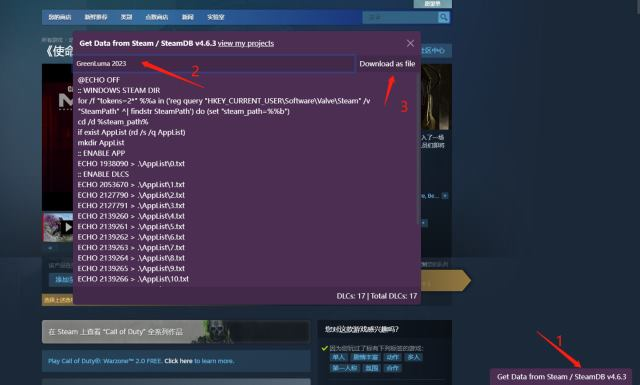

# Get Data from Steam / SteamDB

## 优化
- 更改显示逻辑，在 steam 商店，所有游戏（不管是否有DLC）都会在右下角显示，方便 Greenluma 导入
- 去除 Greenluma2020, 它并不能很好地生效

## 新特性
- 支持 Greenluma2023 一键生成 AppList 文件夹
- 支持 Greenluma2023 隐身模式一键生成 AppList 文件夹
- 支持 Steamtools 拖拽解锁（关闭全部解锁下生效，适用于库中游戏数量较大需要单独解锁的情况）

## 安装
- 首先需要在浏览器安装 [**油猴**](https://tampermonkey.net/), 然后点击 [**这里**](https://github.com/jorejia/GetDLCInfoFromSteamDB/raw/master/dist/sak32009-get-data-from-steam-steamdb.user.js) 自动跳转安装脚本

## 用法
- 安装之后，在 steam 商店右下角可以看到脚本界面，点击打开使用
### Greenluma
- 如果 AppList 文件夹在 steam 目录，下载 `Greenluma2023` 下的 .bat 文件，在任意位置运行即可
- 如果是在其他目录（Greenluma目录），即隐身模式，下载 `Greenluma2023 (Stealth Mode)` 下的 .bat 文件放在指定位置运行，会在脚本文件当前目录生成 AppList 文件夹

### Steamtools
- 选中 INSTALL/UNLOCK APP 下的文字，拖拽到 steamtools 悬浮窗，如果未入库则触发安装（仅入库非真实安装，如需要下载，请移步 [**ManifestAutoUpdate**](https://github.com/wxy1343/ManifestAutoUpdate)，如果已入库则解锁，重启生效
- 选中 UNLOCK DLCS 下文字，拖拽到 steamtools 悬浮窗，解锁 DLC
- 拖动到悬浮窗时同时按住 Cltr 则可以取消解锁

